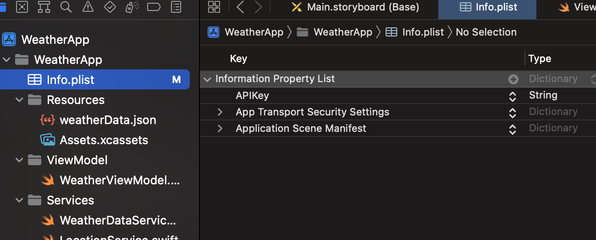
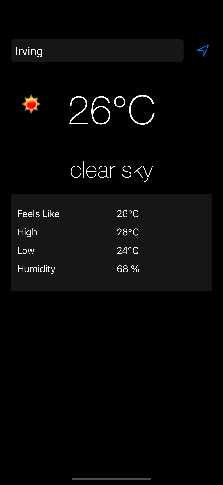
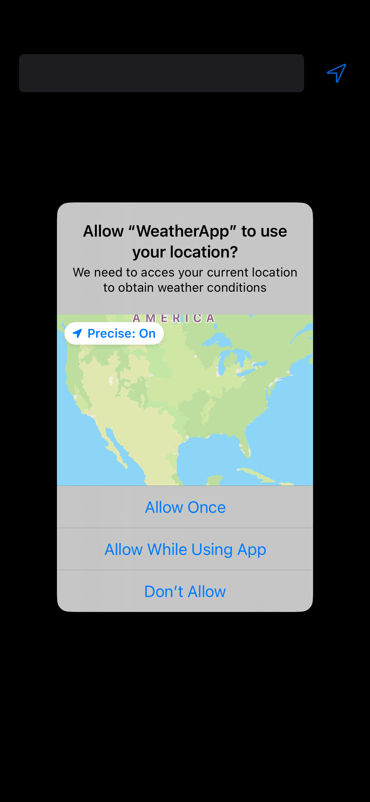

# WatherApp

• Please use a API key provided by openweathermap.org

• For first launch the app will ask location permissions.

• After givin permissions it will load current location weather data.

• Type in desired City name to load that weather data.

• After reopening the app if there is last search city it will fetch that weather data othere wise current location weather is displayed.

• If anytime you need current location's weather click on location icon besides the text field.

